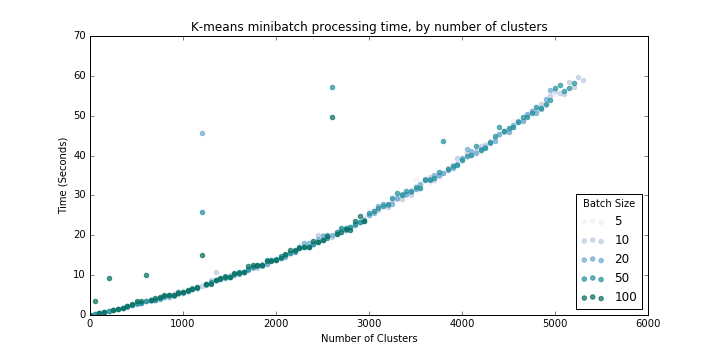
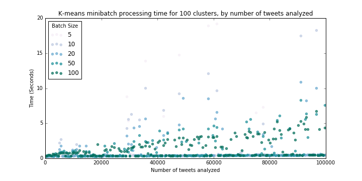
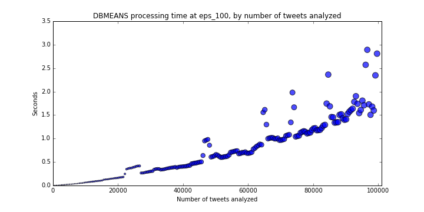

# Tweet Clustering

*Exploratory data analysis of one million tweets using clustering techniques in scikit-learn.  
Civil & Environmental Engineering 263n: Scalable Spatial Analytics at UC-Berkeley, Fall 2016  
By Paul Sohn, September 14, 2016*

The scikit-learn package in Python includes many options for clustering algorithms. We will get to know three of them using a dataset of
 1 million tweets (mostly) from the Bay Area. We will start with a random subset of 100,000 tweets to test the algorithms. The clustering algorithms
 we are using here are: 

* K-means
* MiniBatch K-means
* DBSCAN

The first step is to understand the processing limits of each algorithm.


# Part 1: Baseline Results for Different Clustering Algorithms

## K-means

We are trying to find the reference time of clustering of 100K samples into k=100 clusters with k-means.
 The basic python code snippet involves instatiating a KMeans object, fitting to a numpy array (`data`), and printing the time taken: 

```
k_means = KMeans(n_clusters=100, init='k-means++', n_init=10)

t0 = time.time()
k_means.fit(data)
print time.time() - t0
```

Time to cluster 100,000 tweets into 100 clusters using K-means: **20.7 seconds**

We can implement the above processing time test using various values for the number of requested clusters `k`, increasing `k` until processing time
reaches an arbitrary threshold above which performance is no longer acceptable (code for this loop is below in Part 2). If we select 60 seconds 
as the threshold, we find a `k_max` of ~**311 clusters**.  

## MiniBatch K-means

As above, we are trying to find the reference time of clustering of 100K samples into k=100 clusters with MiniBatch k-means.
The python code is very similar, except one has to select a batch size. 
We can simply test several arbitrary batch size values as below: 

```
for batch_size in [5, 10, 20, 50, 100, 500, 1000]:

    mb = MiniBatchKMeans(n_clusters=100, init='k-means++', n_init=10, batch_size=batch_size)

    t0 = time.time()
    mb.fit(data)
    print time.time() - t0
```

Batch Size | Time to generate 100 clusters (seconds)
--- | ---
5 | 5.29
10 | 2.84
20 | 2.69
50 | 1.48
100 | 0.74
500 | 0.63
1000 | 0.70

Like with k-means above, we can find `k_max` for various batch sizes (code for this loop is below in Part 2). If we select 60 seconds 
as the threshold, we find the following values of `k_max`:

Batch Size | Maximum Number of Clusters
--- | ---
5 | 5000
10 | 5300
20 | 4950
50 | 5200

Interestingly, it turns out that the maximum number of clusters does not vary with batch size, but in any case, `k_max` is much, much higher than for the 
basic K-means algorithm.

## DBSCAN

DBSCAN is different from the other algorithms in that it does not produce a set number of clusters but instead
 detects as many clusters as exist based on two parameters:
 
* `eps`, or the "The maximum distance between two samples for them to be considered as in the same neighborhood" and 
* `min_samples`, the "number of samples (or total weight) in a neighborhood for a point to be considered as a core point." (Language taken from [sklearn documentation](http://scikit-learn.org/stable/modules/generated/sklearn.cluster.DBSCAN.html)).

Our goal here is to find the value of `eps` in DBScan resulting in approximately 100 clusters (`eps_100`) 
of a minimum of samples (`min_samples=100`) and the corresponding processing time.
Furthermore, we can convert `eps`, which is in degrees latitude and longitude, into a more meaningful unit like miles. 
We will use a *very* rough approximation of 100 kilometers per degree:  

```
miles = .75
kilometers = miles / 0.621371
eps = kilometers / 100
```

Then we can loop through various values of `eps` to find `eps_100`, the value that will give us approximately 100 clusters:

```
dbscan = DBSCAN(eps=eps, min_samples=100)
dbscan.fit(data)
print len(numpy.unique(dbscan.labels_))
```

miles | espilon|clusters|seconds
---|---|---|---
0.1 | 0.00160934449789|45|0.873108863831
0.2 | 0.00321868899579|70|1.11532998085
0.3 | 0.00482803349368|106|1.34408187866
0.4 | 0.00643737799157|126|1.49612116814
0.5 | 0.00804672248946|119|1.59469985962
0.6 | 0.00965606698736|103|1.79232883453
0.7 | 0.0112654114852|86|2.09918904305
0.8 | 0.0128747559831|72|2.40508508682
0.9 | 0.014484100481|61|5.46035599709

I select **0.009656** as `eps_100`. I could have also used a smaller value but chose to be inclusive.

# Part 2: Scalability of Clustering Algorithms

In this section, we will expand the baseline results from the previous section to see how performance scales by:

* Number of clusters (K-means and MiniBatch K-means only)
* Number of data points processed

## K-means

### Number of requested clusters

We can find `k_max` as reported above by looping the K-means model through values of `k` (number of clusters) with the set of 100,000 tweets:

```
for k in range(2, 10000, 5): # I externally set a timeout of 60 seconds
    k_means = KMeans(n_clusters=k, init='k-means++', n_init=10)

    t0 = time.time()
    k_means.fit(data)
    print time.time() - t0
```

Results are as follows (Figure 1 in PDF); processing time for the K-means algorithm seems to scale linearly at a rate of 0.181 seconds per cluster. 


### Number of data points processed

We are now trying to find the processing time of K-means for varying numbers of data samples (consider the range of 100 to 100,000) for a fixed k=100. 
To achieve this, we simply run a loop fitting the K-means model to random samples of various sizes:

```
for n in range(100, 100000, 500):
    k_means = KMeans(n_clusters=100, init='k-means++', n_init=10)

    data = data[numpy.random.randint(low=0, high=len(data), size=n), :]

    t0 = time.time()
    k_means.fit(data)
    print time.time() - t0
```  

The results are as follows (Figure 2 in PDF). Again, there is a linear pattern of about 1.84 seconds of processing time per 10,000 additional tweets. Extrapolating this rate, 
generating 100 clusters from a dataset of 1,000,000 tweets would take about **184 seconds**, three times our acceptable threshold of 60 seconds.  


## MiniBatch K-means

### Number of requested clusters

We can find `k_max` similarly to above, looping through `k` (number of clusters) as well as values of `batch_size` with the set of 100,000 tweets:

```
for batch_size in [5, 10, 20, 50, 100]:
    for k in range(2, 10000, 5): # I externally set a timeout of 60 seconds
        mb = MiniBatchKMeans(n_clusters=k, init='k-means++', n_init=10, batch_size=batch_size, init_size=max(30, k))

        t0 = time.time()
        mb.fit(data)
        print time.time() - t0
```

Results below (Figure 3) suggest that processing time scales at an increasing rate with number of clusters requested, 
but of course processing time is much lower than for equivalent numbers of clusters with the basic K-means algorithm.



### Number of data points processed

We use a similar loop through varying sample sizes (from 100 to 100,000) at `k=100`:

```
for batch_size in [5, 10, 20, 50, 100]:
    for n in range(100, 100000, 500): 
        mb = MiniBatchKMeans(n_clusters=100, init='k-means++', n_init=10, batch_size=batch_size)

        data = data[np.random.randint(low=0, high=len(data), size=n), :]

        t0 = time.time()
        mb.fit(data)
        print time.time() - t0
```  

These results (Figure 4) suggest that processing time for 100 clusters essentially *does not scale* with sample size, at least in the vicinity of our sample sizes.
So we can expect processing time for 1,000,000 tweets to be between **0-5 seconds**.  



## DBSCAN

### Number of data points processed

Like the other algorithms, we will loop through various sample sizes (from n=100 to 100,000), this time using a fixed `eps_100=0.009656` that we found above. 

```
for n in range(100, 100000, 500):
    dbscan = DBSCAN(eps=eps,
                    min_samples=min_samples)

    data = data[np.random.randint(low=0, high=len(data), size=n), :]

    t0 = time.time()
    dbscan.fit(data)
    print time.time() - t0
```

I did not set a legend for the results below (Figure 5) but the size of circles is proportional to the number of clusters detected. 
These results show that this implementation, at this value of `eps`, does scale quite well with sample size, and should process 1,000,000 samples within **15-25 seconds**;
well within our acceptable range.



## Summary of scalability

We've learned a couple of things about the three algorithms and how their performance scales:

* K-means does not scale well, in terms of the size of the dataset, and in terms of detecting large numbers of clusters. 
While getting 100 clusters is not too slow for a sample of n=100,000, this algorithm doesn't perform well for larger datasets. 
* MiniBatch K-means also does not scale well in terms of number of clusters, but is much faster than the vanilla K-means implementation, depending on batch size.
* MiniBatch K-means does scale well with larger datasets, if the number of clusters is low (in our example, k=100). This means we can feasibly use this to 
detect 100 clusters for even a dataset with 1,000,000 samples.
* DBSCAN can handle relatively large datasets well, at least at certain values of `eps`.' But this algorithm (at least the sklearn implementation) 
is highly memory-intensive such that clustering 1,000,000 samples is infeasible. 

# Part 3: Handling 1 million samples

Having tested the three algorithms with a smaller dataset of 100,000 samples, we can now turn our attention to the problem of trying to cluster 1,000,000 tweets.
Specifically, we want to find all clusters with at least 100 samples within a radius of 100 meters.
The basic limitations of the existing algorithms are as follows:

* K-means is too slow to handle that many data points or that many clusters
* MiniBatch K-means is also too slow for many clusters, but can handle large data well for a small number of clusters
* DBSCAN is fast in creating many clusters, but cannot handle datasets beyond a certain size

Our strategy to cluster the 1,000,000 samples is therefore a multi-step process:

* (Step 0): I actually remove data from outside the Bay Area for more accuracy, but this reduces the dataset to ~800,000, making my implementation a bit faster.
* Step 1: Create 100 (large) clusters with MiniBatch K-means, with a large batch size
* Step 2: Within each cluster, detect clusters with at least 100 samples within a radius of 100 meters using DBSCAN
* Step 3: Combining the two clusters identified, label tweets in the full dataset with a unique cluster

The final implementation can be found in `solution.py`.

## Results

Runtime: **17.2 seconds**  
Clusters detected: **1239**

## Visualized Results

