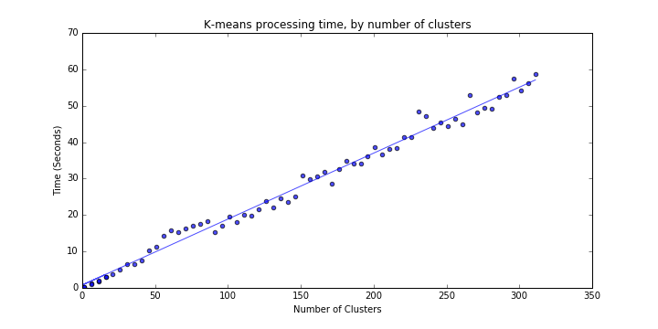
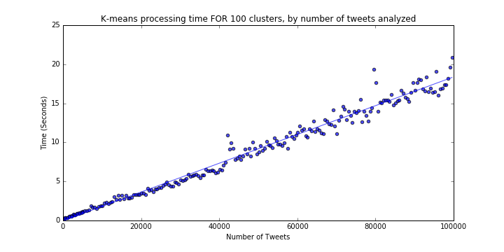

# Tweet Clustering

Exploratory data analysis of one million tweets using clustering techniques in scikit-learn.  
Civil & Environmental Engineering 263n: Scalable Spatial Analytics at UC-Berkeley, Fall 2016  
By Paul Sohn, September 14, 2016

# Part 1: Baseline Results for Different Clustering Algorithms

We will test three different clustering algorithms through the scikit-learn packing in Python:

* K-means
* MiniBatch K-means
* DBSCAN

The first step is to understand the processing limits of each algorithm. The dataset we are using includes 1 million tweets (mostly) from the Bay Area.
 We will start with a random subset of 100,000 tweets to test the algorithms.

## K-means

We are trying to find the reference time of clustering of 100K samples into k=100 clusters with k-means.
 The basic python code snippet involves instatiating a KMeans object, fitting to a numpy array (`data`), and printing the time taken: 

```
k_means = KMeans(n_clusters=100, init='k-means++', n_init=10)

t0 = time.time()
k_means.fit(data)
print time.time() - t0
```

Time to cluster 100,000 tweets into 100 clusters using K-means: **20.7 seconds**

## MiniBatch K-means

As above, we are trying to find the reference time of clustering of 100K samples into k=100 clusters with MiniBatch k-means.
The python code is very similar, except one has to select a batch size. 
We can simply test several arbitrary batch size values as below: 

```
for batch_size in [5, 10, 20, 50, 100, 500, 1000]:

    mb = MiniBatchKMeans(n_clusters=100, init='k-means++', n_init=10, batch_size=batch_size)

    t0 = time.time()
    mb.fit(data)
    print time.time() - t0
```

Batch Size | Time to generate 100 clusters (seconds)
--- | ---
5 | 5.29
10 | 2.84
20 | 2.69
50 | 1.48
100 | 0.74
500 | 0.63
1000 | 0.70

## DBSCAN

DBSCAN is different from the other algorithms in that it does not produce a set number of clusters but instead
 detects as many clusters as exist based on two parameters:
 
* `eps`, or the "The maximum distance between two samples for them to be considered as in the same neighborhood" and 
* `min_samples`, the "number of samples (or total weight) in a neighborhood for a point to be considered as a core point." (Language taken from [sklearn documentation](http://scikit-learn.org/stable/modules/generated/sklearn.cluster.DBSCAN.html)).

Our goal here is to find the value of `eps` in DBScan resulting in approximately 100 clusters (`eps_100`) 
of a minimum of samples (`min_samples=100`) and the corresponding processing time.
Furthermore, we can convert `eps`, which is in degrees latitude and longitude, into a more meaningful unit like miles. 
We will use a *very* rough approximation of 100 kilometers per degree:  

```
miles = .75
kilometers = miles / 0.621371
eps = kilometers / 100
```

Then we can loop through various values of `eps` to find `eps_100`, the value that will give us approximately 100 clusters:

```
dbscan = DBSCAN(eps=eps, min_samples=100)
dbscan.fit(data)
print len(numpy.unique(dbscan.labels_))
```

miles | espilon|clusters|seconds
---|---|---|---
0.1 | 0.00160934449789|45|0.873108863831
0.2 | 0.00321868899579|70|1.11532998085
0.3 | 0.00482803349368|106|1.34408187866
0.4 | 0.00643737799157|126|1.49612116814
0.5 | 0.00804672248946|119|1.59469985962
0.6 | 0.00965606698736|103|1.79232883453
0.7 | 0.0112654114852|86|2.09918904305
0.8 | 0.0128747559831|72|2.40508508682
0.9 | 0.014484100481|61|5.46035599709

I select **0.009656** as `eps_100`. I could have also used a smaller value but chose to be inclusive.

# Part 2: Scalability of Clustering Algorithms

In this section, we will expand the baseline results from the previous section to see how performance scales by:

* Number of clusters (K-means and MiniBatch K-means only)
* Number of data points processed

## K-means

### Number of requested clusters

We are now trying to find the processing time of K-means for varying numbers of data samples (consider the range of 100 to 100’000) for a fixed k=100. 
To achieve this, we simply run a loop fitting the K-means model to random samples of various sizes:

```
for n in range(100, 100000, step):
    k_means = KMeans(n_clusters=k, init='k-means++', n_init=10)

    data = data[numpy.random.randint(low=0, high=len(data), size=n), :]

    t0 = time.time()
    k_means.fit(data)
    t1 = time.time() - t0
```  





